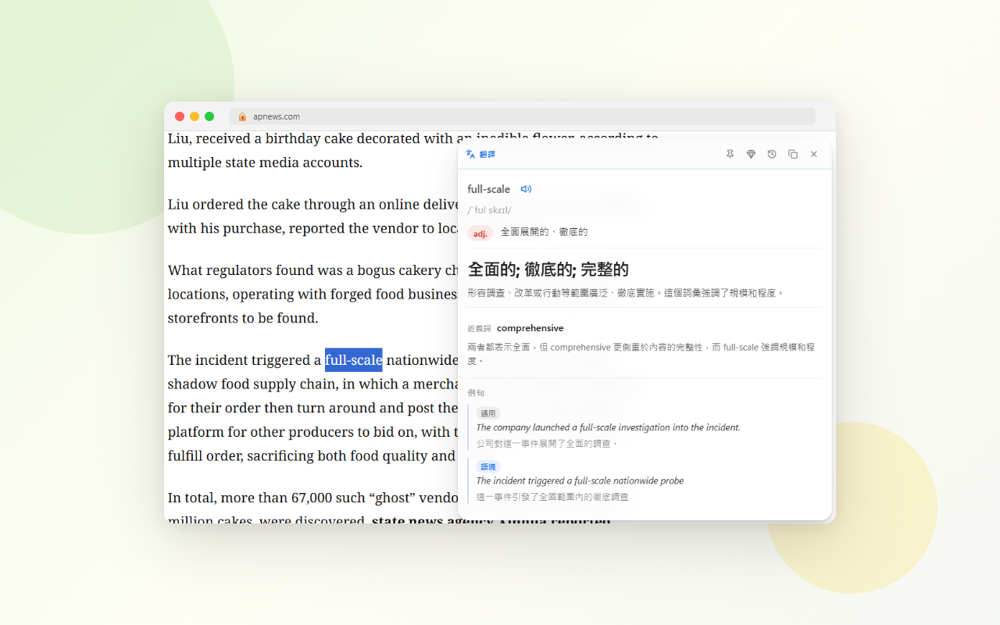
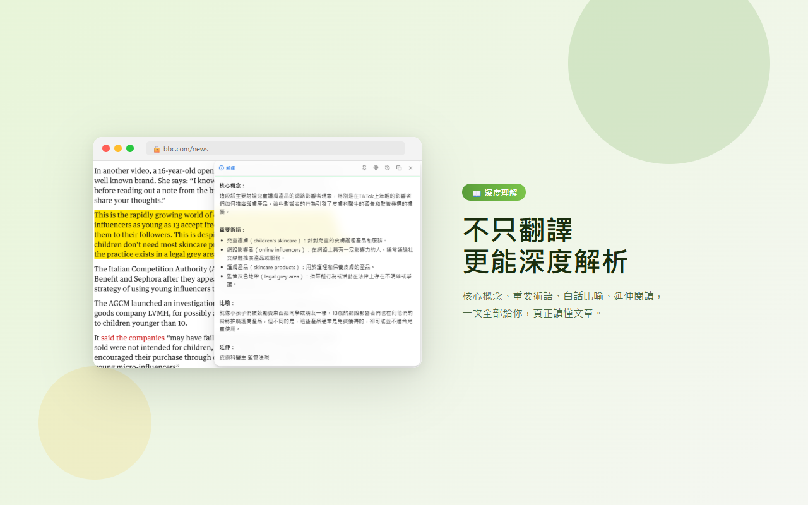
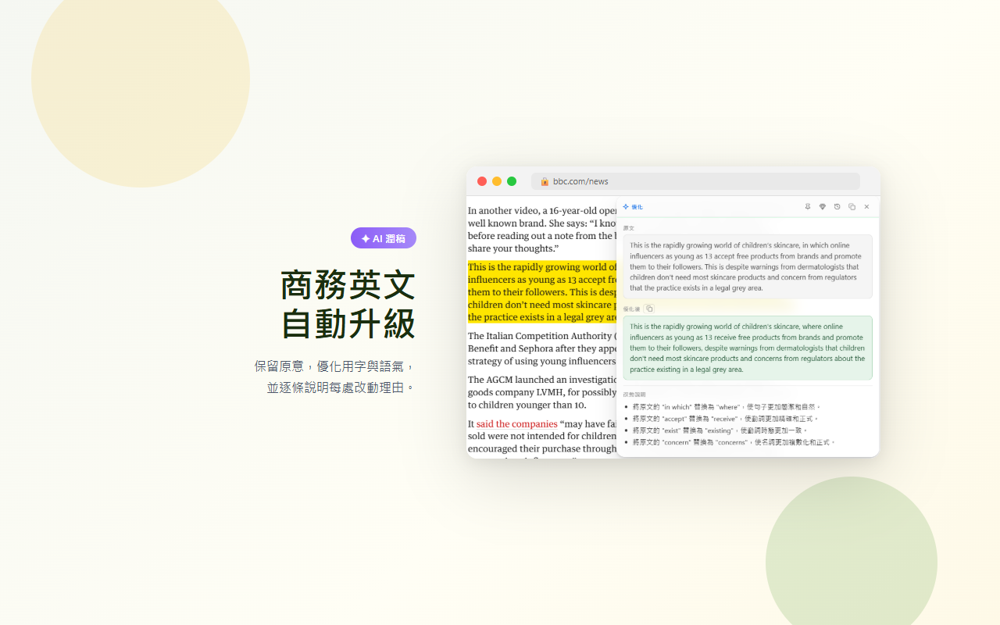
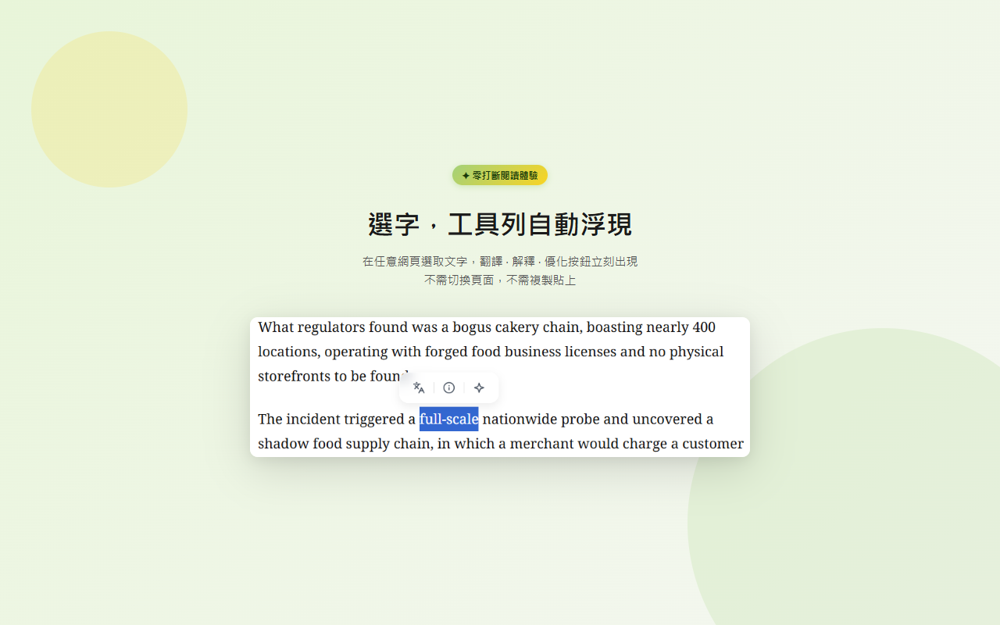
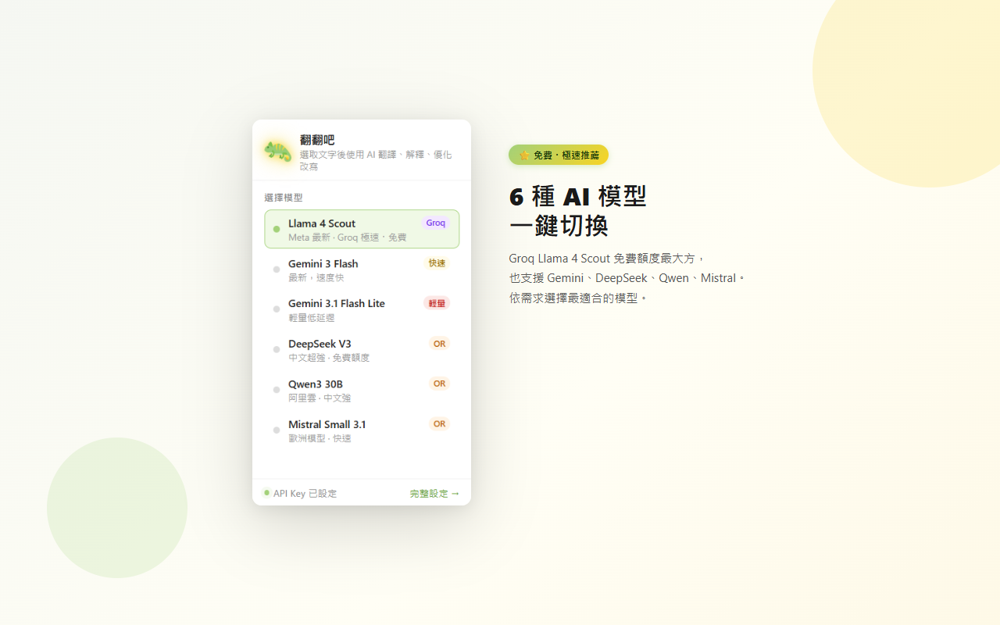

# 翻翻吧 Fan Fan Ba

> AI-powered translation, explanation & text optimizer for Chrome / Edge
> 

看到不懂的一劃就翻譯、解釋，還能順手存進筆記，一氣呵成。  
選取任意網頁文字，一鍵觸發翻譯、解釋、優化——多家 AI 模型驅動，結果即時浮現，不打斷閱讀流。

---

## ✨ 功能亮點

### 三大核心功能

| 功能 | 單字模式 | 段落模式 |
|------|---------|---------|
| **翻譯** | 字典卡：音標、詞性、釋義、近義詞、例句（通用＋語境） | 直接翻譯成繁體中文 |
| **解釋** | 詞彙含義 + 上下文語境分析 + 可點擊延伸標籤 | 核心概念、術語說明、段落總結 |
| **優化** | 原文（灰底）→ 優化後（綠底）→ 改動說明 | 重寫使文字更清晰流暢，維持原文語言 |

### 其他功能
- 🔊 **朗讀** — 優先使用 Google Cloud Chirp HD 高品質語音；未設定則自動 fallback 瀏覽器內建語音
- 📝 **存入 Obsidian** — 一鍵 append 到週記筆記（`YYYY-W##.md`），存入後自動切回原分頁保留結果卡；字典模式保留完整結構化 markdown；macOS / Windows 跨平台相容
- 💾 **設定備份 / 還原** — 匯出 JSON 設定檔，重新安裝後可匯入；API Key 預設不匯出，需使用者明確勾選
- ☁️ **Google Drive 雲端同步（v1.7.0）** — 可同步模型、語言、Obsidian、全文翻譯等一般設定到 Drive appData；API Key 不會雲端同步
- 🕐 **最近查詢紀錄** — 結果卡 Header 時鐘按鈕展開最近 5 筆紀錄，點擊即可重新載入
- 📌 **釘住結果卡** — Pin 後選取新文字不關閉卡片，頂部藍線顯示釘住狀態
- ↔️ **邊緣吸附** — 拖曳至螢幕邊緣自動吸附，含 snap 動畫
- 🔄 **錯誤重試** — API 錯誤時顯示「↺ 重試」按鈕，一鍵重送請求
- ⌨️ **鍵盤與動作偏好** — 主要控制支援可見鍵盤焦點，並尊重系統 reduced motion 設定
- 🎨 **Glassmorphism UI** — 毛玻璃懸浮工具列 + 結果卡，不遮擋頁面內容，可自由拖曳

---

## 🤖 支援的 AI 模型

| 模型 | Provider | 說明 |
|------|----------|------|
| **Llama 4 Scout** ⭐ | Groq | Meta 最新 MoE 模型，Groq 極速推論，**免費額度最大方，預設推薦** |
| Gemini 3.5 Flash | Google | 最新穩定 Flash 模型，適合日常翻譯、解釋與優化 |
| DeepSeek V4 Flash | OpenRouter | 免費模型，中文、推理與程式任務表現佳 |

---

## 📦 安裝方式

### 方法一：從 Chrome Web Store 安裝（推薦）
> 即將上架，敬請期待

### 方法二：開發者模式手動載入

1. 下載或 clone 本 Repo
   ```bash
   git clone https://github.com/unomae/fan-fan-ba.git
   ```
2. 開啟 Chrome / Edge，前往 `chrome://extensions` 或 `edge://extensions`
3. 開啟右上角「**開發人員模式**」
4. 點擊「**載入未封裝擴充功能**」，選擇 clone 下來的資料夾
5. 擴充功能圖示出現於工具列即完成，首次安裝會自動開啟使用說明頁

---

## ⚙️ 設定

點擊工具列圖示 → **完整設定 →**，依照使用的模型填入對應 API Key：

| Provider | API Key 格式 | 取得方式 | 備註 |
|----------|-------------|---------|------|
| **Groq** | `gsk_...` | [Groq Console](https://console.groq.com/keys) | **必填・免費，強烈推薦** |
| Google Gemini | `AIza...` | [Google AI Studio](https://aistudio.google.com/app/apikey) | 選填，只有基本免費額度 |
| OpenRouter | `sk-or-...` | [OpenRouter](https://openrouter.ai/keys) | 選填，只有基本免費額度 |
| Google Cloud TTS | `AIza...` | [Google Cloud Console](https://console.cloud.google.com/apis/credentials) | 選填，高品質朗讀 |

> **Obsidian 整合**：需安裝 [Advanced URI 插件](https://github.com/Vinzent03/obsidian-advanced-uri)，在設定頁填入 Vault 名稱與資料夾。每週會依使用者填寫的資料夾階層建立 `YYYY-W##.md` 週記檔。

---

## 🚀 使用方式

1. 在任意網頁**選取文字**
2. 稍等約 0.3 秒，工具列自動浮現於選取文字旁
3. 點擊對應功能按鈕：

   | 圖示 | 功能 |
   |------|------|
   | 雙語圖示 | 翻譯 |
   | 圓圈資訊圖示 | 解釋 |
   | 四角星圖示 | 優化 |
   | 🔊 喇叭圖示 | 朗讀（結果卡內） |
   | 💎 寶石圖示 | 存入 Obsidian（結果卡內） |

4. 結果卡浮現，可拖曳移動位置
5. 點擊結果卡外部或按 `Esc` 關閉

---

## 🏗️ 技術架構

```
fan-fan-ba/
├── manifest.json         # Manifest V3，僅 storage 權限 + 4 個 API host
├── background.js         # Service Worker：API 分流 + Streaming + TTS + Obsidian URI
├── content/
│   ├── state.js          # 共用狀態變數（isPinned / obsidianSaving / 快取 Map 等）
│   ├── utils.js          # escapeHtml / formatMarkdown / parseJSON / getWeekLabel
│   ├── obsidian.js       # Obsidian 存入 + 最近資料夾管理
│   ├── toolbar.js        # 懸浮工具列 UI + 定位
│   ├── result-card.js    # 結果卡 UI + 渲染（字典 / 解釋 / 優化）+ 歷史紀錄
│   └── main.js           # 事件監聽 + triggerAction + 串流 / 非串流分流
├── content.css           # Glassmorphism 樣式（16 個 section，全部 !important）
├── popup.html / js       # 模型快選 Popup
├── options.html / js     # 完整設定頁
├── welcome.html / js     # 首次安裝 Onboarding 頁面
├── privacy-policy.html   # 隱私權政策
├── design.md             # 設計語言規範（色彩 / 元件 / 動畫）
└── icons/                # 16 / 48 / 64 / 128 px
```

**技術特點**
- **Manifest V3**：Service Worker 架構，API Key 只在 background 層使用，不暴露於頁面
- **Cloud Sync**：使用 Chrome Identity + Google Drive appDataFolder 同步一般設定；正式使用前需在 `manifest.json` 設定 Google OAuth Client ID
- **Streaming 回應**：段落翻譯 / 解釋 / 優化使用 `chrome.runtime.connect()` + SSE，字典模式維持完整 JSON 回應；請求逾時與停止會中止底層 fetch
- **同文字快取**：`Map` 快取相同 action + text 的結果，tab 生命週期內命中直接渲染
- **模組化架構**：content scripts 按職責拆分為 6 個檔案，透過 manifest 依序載入共用同一 isolated world
- **CSS 隔離**：`!important` 防止宿主頁樣式干擾，CSS 變數限定在元件 selector 避免污染 `:root`
- **多 Provider 分流**：`groq:` / `openrouter:` 前綴識別，統一 OpenAI 相容介面
- **Exponential Backoff + Jitter**：429 / 503 自動重試，最多 3 次
- **Onboarding**：`chrome.runtime.onInstalled` 首次安裝自動開啟 Welcome 頁面

---

## 📸 介面預覽

<table>
  <tr>
    <td align="center" colspan="2"><b>翻譯 — 字典式詳細解說</b></td>
  </tr>
  <tr>
    <td align="center" colspan="2"></td>
  </tr>
  <tr>
    <td align="center" width="50%"><b>解釋 — 核心概念・術語・比喻</b></td>
    <td align="center" width="50%"><b>優化 — AI 潤稿改寫</b></td>
  </tr>
  <tr>
    <td align="center"></td>
    <td align="center"></td>
  </tr>
  <tr>
    <td align="center"><b>選字，工具列自動浮現</b></td>
    <td align="center"><b>3 種 AI 模型一鍵切換</b></td>
  </tr>
  <tr>
    <td align="center"></td>
    <td align="center"></td>
  </tr>
</table>

---

## 🔒 隱私

- 所有 API Key **僅存於本機** `chrome.storage.local`，不上傳至任何伺服器，也不跟 Chrome 帳號同步
- 設定頁可匯出 / 匯入設定檔；只有勾選「包含 API Keys」時，匯出的 JSON 才會明文包含金鑰
- Google Drive 雲端同步只同步一般設定，不包含 API Key；API Key 加密雲端備份規劃於 v1.7.1
- 選取的文字**僅傳送給使用者選擇的 AI 服務商**，用於處理當次請求
- 本擴充功能不設伺服器，不收集任何使用者資料

完整說明：[隱私權政策](privacy-policy.html)

---

## 📄 License

MIT
