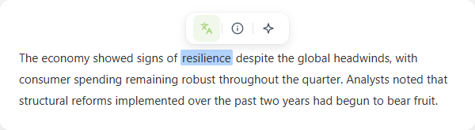
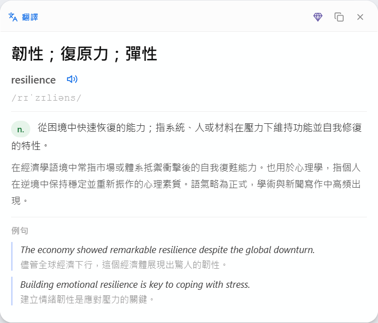
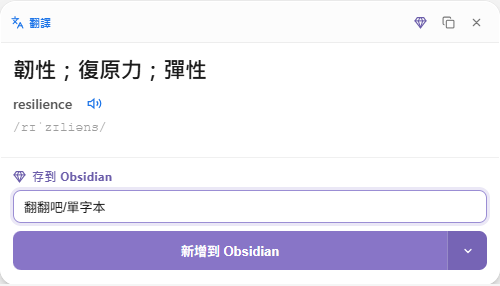
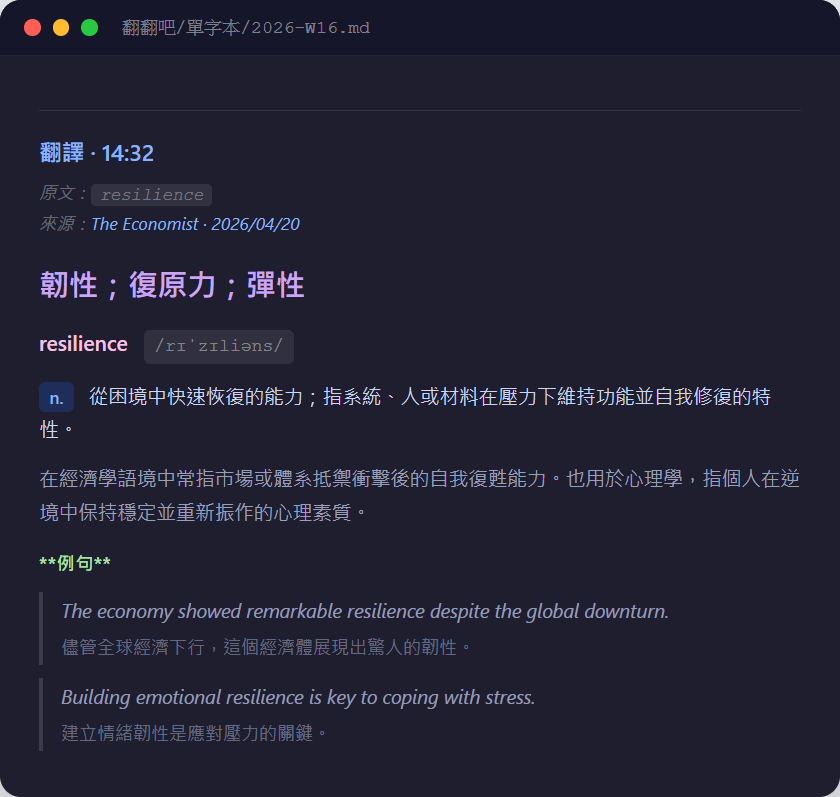

# 翻翻吧 Fan Fan Ba

> AI-powered translation, explanation & text optimizer for Chrome / Edge
> 

劃字就懂啦！翻譯解釋秒出現，順手存Obsidian不遺忘多復習。  
選取任意網頁文字，一鍵觸發翻譯、解釋、優化——多家 AI 模型驅動，結果即時浮現，不打斷閱讀流。

---

## ✨ 功能亮點

### 三大核心功能

| 功能 | 單字模式 | 段落模式 |
|------|---------|---------|
| **翻譯** | 字典卡：詞性、音標、釋義、例句 | 直接翻譯成繁體中文 |
| **解釋** | 詞彙含義 + 上下文語境分析 | 核心概念、術語說明、段落總結 |
| **優化** | 提供 2–3 個更精準的替換選項 | 重寫使文字更清晰流暢 |

### 其他功能
- 🔊 **朗讀** — 優先使用 Google Cloud Chirp HD 高品質語音；未設定則自動 fallback 瀏覽器內建語音
- 📝 **存入 Obsidian** — 透過 Advanced URI 協定將結果存入週記筆記（`2026-W16.md`），字典模式保留完整結構化 markdown
- 🎨 **Glassmorphism UI** — 毛玻璃懸浮工具列 + 結果卡，不遮擋頁面內容，可自由拖曳

---

## 🤖 支援的 AI 模型

| 模型 | Provider | 說明 |
|------|----------|------|
| Gemini 3.1 Flash Lite | Google | 輕量低延遲 |
| Gemini 3 Flash | Google | 速度快，適合日常使用 |
| Llama 4 Scout | Groq | Meta 最新 MoE 模型，Groq 極速推論 |
| DeepSeek V3 | OpenRouter | 中文理解超強，有免費額度 |
| Qwen3 30B | OpenRouter | 阿里雲出品，中文強 |
| Mistral Small 3.1 | OpenRouter | 歐洲模型，快速精準 |

---

## 📦 安裝方式

### 方法一：從 Chrome Web Store 安裝（推薦）
> 即將上架，敬請期待

### 方法二：開發者模式手動載入

1. 下載或 clone 本 Repo
   ```bash
   git clone https://github.com/unomae/fan-fan-ba.git
   ```
2. 開啟 Chrome / Edge，前往 `edge://extensions` 或 `chrome://extensions`
3. 開啟右上角「**開發人員模式**」
4. 點擊「**載入未封裝擴充功能**」，選擇 clone 下來的資料夾
5. 擴充功能圖示出現於工具列即完成

---

## ⚙️ 設定

點擊工具列圖示 → **完整設定 →**，依照使用的模型填入對應 API Key：

| Provider | API Key 格式 | 取得方式 |
|----------|-------------|---------|
| Google Gemini | `AIza...` | [Google AI Studio](https://aistudio.google.com/app/apikey)（pay as you go） |
| Groq | `gsk_...` | [Groq Console](https://console.groq.com/keys)（免費） |
| OpenRouter | `sk-or-...` | [OpenRouter](https://openrouter.ai/keys)（有免費額度） |
| Google Cloud TTS | `AIza...` | [Google Cloud Console](https://console.cloud.google.com/apis/credentials)（選填） |

> **Obsidian 整合**：需安裝 [Advanced URI 插件](https://github.com/Vinzent03/obsidian-advanced-uri)，在設定頁填入 Vault 名稱即可。

---

## 🚀 使用方式

1. 在任意網頁**選取文字**
2. 稍等約 0.3 秒，工具列自動浮現於選取文字上方
3. 點擊對應功能按鈕：

   | 圖示 | 功能 |
   |------|------|
   | `Aa` 雙語圖示 | 翻譯 |
   | `ℹ` 圓圈資訊圖示 | 解釋 |
   | `✦` 四角星圖示 | 優化 |
   | `🔊` 喇叭圖示 | 朗讀（結果卡內） |
   | `💎` 菱形寶石圖示 | 存入 Obsidian（結果卡內） |

4. 結果卡浮現，可拖曳移動位置
5. 點擊結果卡外部或按 `Esc` 關閉

---

## 🏗️ 技術架構

```
fan-fan-ba/
├── manifest.json     # Manifest V3 設定
├── background.js     # Service Worker：API 呼叫（Gemini / Groq / OpenRouter）+ TTS
├── content.js        # 選字偵測、工具列 & 結果卡注入、Obsidian 存入
├── content.css       # Glassmorphism 樣式（CSS isolation with all: initial）
├── popup.html/js     # 模型快選 Popup
├── options.html/js   # 完整設定頁
└── icons/            # 16 / 48 / 64 / 128 px
```

**技術特點**
- **Manifest V3**：Service Worker 架構，API Key 只在 background 層使用，不暴露於頁面
- **CSS 隔離**：`all: initial` + `!important` 防止宿主頁樣式干擾
- **多 Provider 分流**：`groq:` / `openrouter:` 前綴識別，統一 OpenAI 相容介面
- **Web Animations API**：工具列入場動畫使用 WAAPI，`fill: 'none'` 避免與 CSS 狀態衝突

---

## 📸 介面預覽

<table>
  <tr>
    <td align="center" width="50%"><b>懸浮工具列</b></td>
    <td align="center" width="50%"><b>翻譯結果卡（字典模式）</b></td>
  </tr>
  <tr>
    <td align="center"></td>
    <td align="center"></td>
  </tr>
  <tr>
    <td align="center"><b>存入 Obsidian 面板</b></td>
    <td align="center"><b>Obsidian 筆記成果</b></td>
  </tr>
  <tr>
    <td align="center"></td>
    <td align="center"></td>
  </tr>
</table>

---

## 🔒 隱私

- 所有 API Key **僅存於本機** `chrome.storage.sync`，不上傳至任何伺服器
- 選取的文字**僅傳送給使用者選擇的 AI 服務商**，用於處理當次請求
- 本擴充功能不設伺服器，不收集任何使用者資料

完整隱私政策：[Privacy Policy](https://gist.github.com/unomae/209600efe580b040774f5eb6c806de12)

---

## 📄 License

MIT
