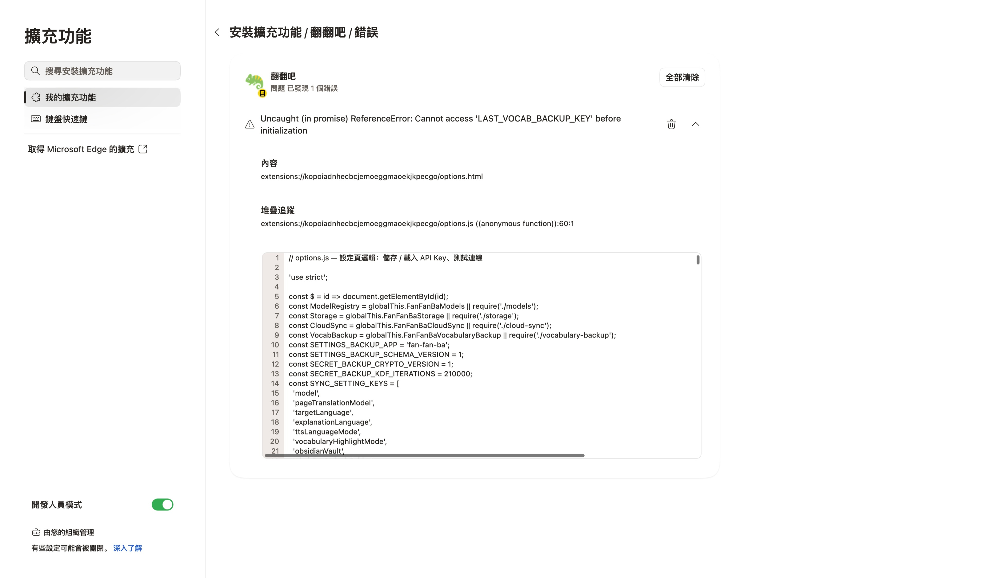

# QA 滿配驗收報告 — E3：Service Worker、Options 啟動與跨元件訊息 — 2026-07-24

**測試範圍：** Service Worker、Options 啟動與跨元件訊息
**測試裝置：** 桌機 1920px + 行動 375px
**測試案例：** 5
**測試結果：** 3 PASS / 1 FAIL / 1 SKIP

## 1. QA 漏測／技術覆盤分析

| 層面 | 本輪觀察 | 為何常規測試可能漏網 |
| --- | --- | --- |
| CSS / RWD | 以 375px 真實 viewport 逐頁量測。 | jsdom 不會驗證實際像素位置。 |
| JS 邏輯 | async microtask 會在常數初始化前讀取 TDZ。 | 單元測試若只驗 DOM / class 存在，可能漏掉 runtime 時序與 computed style。 |
| 外部服務 | 1 案例受 manual gate 限制。 | dummy Key 不可取代真實 provider／OAuth／外部 app。 |
| UX | 發現阻斷或明顯摩擦，需修復後重跑。 | 熟悉產品的人容易用強制操作繞過入口問題。 |

## 2. 核心阻斷性缺陷（P0）

查無 P0。

## 3. 高／中優先缺陷（P1 / P2）

### QA-P2-002 · Options 啟動發生 LAST_VOCAB_BACKUP_KEY TDZ

- 發生位置：chrome-extension://…/options.html
- 影響案例：TC-E3-003
- 預期：啟動無未捕捉錯誤，單字本備份提醒正常渲染。
- 實際：Cannot access LAST_VOCAB_BACKUP_KEY before initialization。
- 技術肇因：initVocabularyBackup() 在常數初始化前呼叫 async renderVocabularyBackupStaleness()。
- 截圖：

## 4. UX 摩擦與未驗證項目（P3 / SKIP）

- TC-E3-002：無真實 API Key，未做雙分頁並行 AI request correlation。

## 5. 完整修復優先級矩陣

| 優先級 | 缺陷 ID | 描述 | 受影響裝置 | 建議負責人 | 預估工時 |
| --- | --- | --- | --- | --- | --- |
| P2 | QA-P2-002 | Options 啟動發生 LAST_VOCAB_BACKUP_KEY TDZ | 桌機 + 行動 | 前端 | 0.5 小時 |

**執行完成度：** 60%（PASS / 全案例，不是產品健康分數）
**可送審建議：** ⚠️ 完成 manual gate 後再判定
