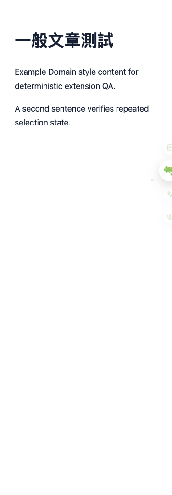

# QA 滿配驗收報告 — F2：浮球、全文翻譯與站點控制 — 2026-07-24

**測試範圍：** 浮球、全文翻譯與站點控制
**測試裝置：** 桌機 1920px + 行動 375px
**測試案例：** 5
**測試結果：** 1 PASS / 1 FAIL / 3 SKIP

## 1. QA 漏測／技術覆盤分析

| 層面 | 本輪觀察 | 為何常規測試可能漏網 |
| --- | --- | --- |
| CSS / RWD | 375px 實際 bounding box 發現浮球裁切。 | jsdom 不會驗證實際像素位置。 |
| JS 邏輯 | 以 pageerror 與實際互動補足靜態測試。 | 單元測試若只驗 DOM / class 存在，可能漏掉 runtime 時序與 computed style。 |
| 外部服務 | 3 案例受 manual gate 限制。 | dummy Key 不可取代真實 provider／OAuth／外部 app。 |
| UX | 發現阻斷或明顯摩擦，需修復後重跑。 | 熟悉產品的人容易用強制操作繞過入口問題。 |

## 2. 核心阻斷性缺陷（P0）

查無 P0。

## 3. 高／中優先缺陷（P1 / P2）

### QA-P1-003 · 375px 浮球展開時仍被右側裁切

- 發生位置：一般文章頁（viewport 375 × 812）
- 影響案例：TC-F2-005
- 預期：展開時主球與所有操作鈕完整位於 viewport 內。
- 實際：主球、收藏、全文翻譯與設定圖示被右側裁切。
- 技術肇因：浮球右側半藏的 translateX(24px) 與 hover／menu-open 位移在窄螢幕互動時發生抖動／回縮；現有測試只驗 class，未驗實際 bounding box。
- 截圖：

## 4. UX 摩擦與未驗證項目（P3 / SKIP）

- TC-F2-001：全文翻譯入口可觸發，缺 Key 狀態可見=true；未做實際段落翻譯。
- TC-F2-002：Alt+T 可觸發前置路徑，但無全文翻譯 Key，未驗證續翻與請求去重。
- TC-F2-004：已建立 120 段／動態內容測試頁；無 API Key，未注入 429／中斷／局部重試。

## 5. 完整修復優先級矩陣

| 優先級 | 缺陷 ID | 描述 | 受影響裝置 | 建議負責人 | 預估工時 |
| --- | --- | --- | --- | --- | --- |
| P1 | QA-P1-003 | 375px 浮球展開時仍被右側裁切 | 375px 行動版 | 前端 / CSS | 1–2 小時 |

**執行完成度：** 20%（PASS / 全案例，不是產品健康分數）
**可送審建議：** ❌ 先修 P1 並回歸
