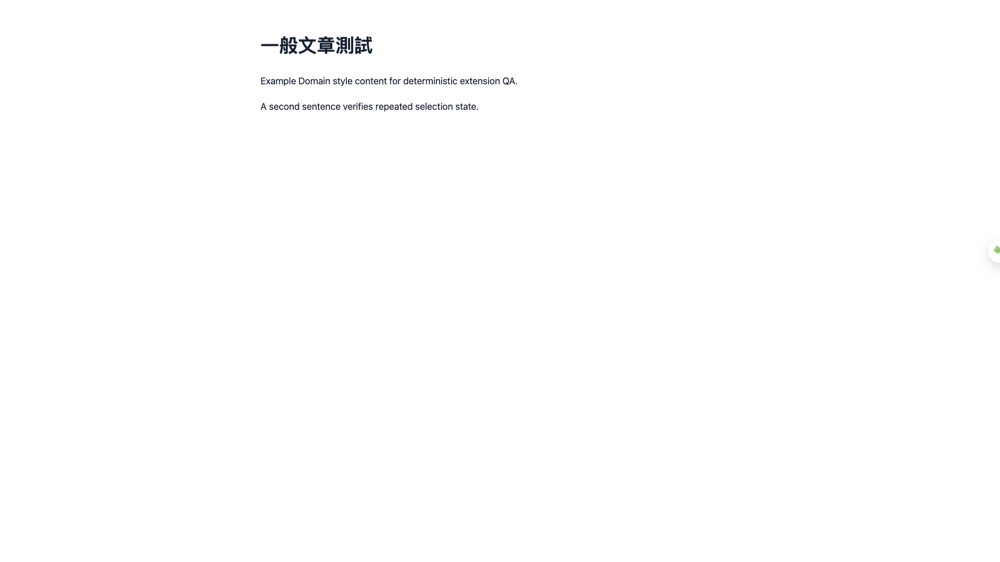

# QA 滿配驗收報告 — F3：收藏、單字本、最近查詢與 Obsidian 入口 — 2026-07-24

**測試範圍：** 收藏、單字本、最近查詢與 Obsidian 入口
**測試裝置：** 桌機 1920px + 行動 375px
**測試案例：** 5
**測試結果：** 0 PASS / 2 FAIL / 3 SKIP

## 1. QA 漏測／技術覆盤分析

| 層面 | 本輪觀察 | 為何常規測試可能漏網 |
| --- | --- | --- |
| CSS / RWD | 以 375px 真實 viewport 逐頁量測。 | jsdom 不會驗證實際像素位置。 |
| JS 邏輯 | DOM 建立成功仍可能因缺少 g-show 而不可見。 | 單元測試若只驗 DOM / class 存在，可能漏掉 runtime 時序與 computed style。 |
| 外部服務 | 3 案例受 manual gate 限制。 | dummy Key 不可取代真實 provider／OAuth／外部 app。 |
| UX | 發現阻斷或明顯摩擦，需修復後重跑。 | 熟悉產品的人容易用強制操作繞過入口問題。 |

## 2. 核心阻斷性缺陷（P0）

查無 P0。

## 3. 高／中優先缺陷（P1 / P2）

### QA-P1-001 · 收藏／紀錄面板建立後保持透明

- 發生位置：一般 HTTPS 頁面 → 浮球 → 收藏／紀錄
- 影響案例：TC-F3-001、TC-F3-005
- 預期：學習庫面板可見，可進入單字本與最近查詢。
- 實際：面板透明且無法操作；桌機與 375px 都重現。
- 技術肇因：showFloatingLibraryPanel() 結尾只定位卡片，未加入 resultCard.classList.add("g-show")。
- 截圖：

## 4. UX 摩擦與未驗證項目（P3 / SKIP）

- TC-F3-002：前置的收藏／紀錄面板被 QA-P1-001 阻擋，且無真實翻譯結果可建立歷史。
- TC-F3-003：未啟動外部 Obsidian／Advanced URI；scheme 白名單改由 Jest 與程式碼稽查證明。
- TC-F3-004：收藏入口被 QA-P1-001 阻擋；5,000 筆邊界保留給修復後回歸。

## 5. 完整修復優先級矩陣

| 優先級 | 缺陷 ID | 描述 | 受影響裝置 | 建議負責人 | 預估工時 |
| --- | --- | --- | --- | --- | --- |
| P1 | QA-P1-001 | 收藏／紀錄面板建立後保持透明 | 桌機 + 行動 | 前端 | 0.5–1 小時 |

**執行完成度：** 0%（PASS / 全案例，不是產品健康分數）
**可送審建議：** ❌ 先修 P1 並回歸
